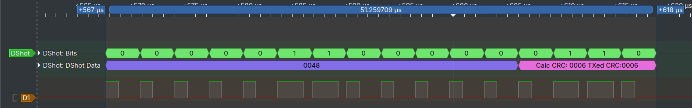

# DShotRMT - ESP32 RMT DShot Driver

[](https://github.com/derdoktor667/DShotRMT/actions/workflows/ci.yml)

An Arduino IDElibrary for generating DShot signals on ESP32 microcontrollers using the **modern ESP-IDF 5 RMT encoder API** (`rmt_tx.h` / `rmt_rx.h`). This library specifically leverages the official `rmt_bytes_encoder` API for an efficient, hardware-timed, and maintainable implementation. It provides a simple way to control brushless motors in both Arduino and ESP-IDF projects.

 The legacy version using the old `rmt.h` API is available in the `oldAPI` branch.

### DShot300 Example Output

Here's an example of the output from the `dshot300` example sketch:



## 🚀 Core Features

- **Multiple DShot Modes:** Supports DSHOT150, DSHOT300, DSHOT600, and DSHOT1200.
- **Bidirectional DShot Support:** Implemented, but note that official support is limited due to potential instability and external hardware requirements. Use with caution.
- **Hardware-Timed Signals:** Precise signal generation using the ESP32 RMT peripheral, ensuring stable and reliable motor control.
- **Simple API:** Easy-to-use C++ class with intuitive methods like `sendThrottlePercent()`.
- **Error Handling:** Provides detailed feedback on operation success or failure via `dshot_result_t`.
- **Lightweight:** The core library has no external dependencies.
- **Arduino and ESP-IDF Compatible:** Can be used in both Arduino and ESP-IDF projects.

## ⏱️ DShot Timing Information

The DShot protocol defines specific timing characteristics for each mode. The following table outlines the bit length, T1H (high time for a '1' bit), T0H (high time for a '0' bit), and frame length for the supported DShot modes:

| DShot Mode | Bit Length (µs) | T1H Length (µs) | T0H Length (µs) | Frame Length (µs) |
| :--------- | :-------------- | :-------------- | :-------------- | :---------------- |
| DSHOT150   | 6.67            | 5.00            | 2.50            | 106.72            |
| DSHOT300   | 3.33            | 2.50            | 1.25            | 53.28             |
| DSHOT600   | 1.67            | 1.25            | 0.625           | 26.72             |
| DSHOT1200  | 0.83            | 0.67            | 0.335           | 13.28             |

## 📦 Installation

### Arduino IDE

1.  Open the Arduino Library Manager (`Sketch` > `Include Library` > `Manage Libraries...`).
2.  Search for "DShotRMT" and click "Install".
3.  Alternatively, you can clone this repository or download it as a ZIP file and place it in your Arduino libraries folder (`~/Arduino/libraries/DShotRMT/`).

## ⚡ Quick Start

Here's a basic example of how to use the `DShotRMT` library to control a motor. Please use example sketches for more detailes:

```cpp
#include <Arduino.h>
#include <DShotRMT.h> // Include the DShotRMT library

// Define the GPIO pin connected to the motor ESC
const gpio_num_t MOTOR_PIN = GPIO_NUM_27;

// Create a DShotRMT instance for DSHOT300
DShotRMT motor(MOTOR_PIN, DSHOT300);

void setup() {
  Serial.begin(115200);

  // Initialize the DShot motor
  motor.begin();

  // Print CPU Info
  printCpuInfo(Serial);

  Serial.println("Motor initialized. Ramping up to 25% throttle...");
  
}

void loop() {
  // Ramp up to 25% throttle over 2.5 seconds
  for (int i = 0; i <= 25; i++) {
    motor.sendThrottlePercent(i);
    delay(100);
  }
  
  Serial.println("Stopping motor.");
  motor.sendThrottlePercent(0);

  // Print DShot Info
  printDShotInfo(motor, Serial);
}
```

## 🎮 Examples

The `examples` folder contains more advanced examples:

- **`throttle_percent`:** A focused example showing how to control motor speed using percentage values (0-100) via the serial monitor.
- **`dshot300`:** A more advanced example demonstrating how to send raw DShot commands and receive telemetry via the serial monitor.
- **`web_control`:** A full-featured web application for controlling a motor from a web browser. It creates a WiFi access point and serves a web page with a throttle slider and arming switch.
- **`web_client`:** A variation of the `web_control` example that connects to an existing WiFi network instead of creating its own access point.

### Dependencies for Web Examples

The `web_control` and `web_client` examples require the following additional libraries:

- [ArduinoJson](https://github.com/bblanchon/ArduinoJson)
- [ESPAsyncWebServer](https://github.com/ESP32Async/ESPAsyncWebServer)
- [AsyncTCP](https://github.com/ESP32Async/AsyncTCP)

## 📚 API Reference

The main class is `DShotRMT`. Here are the most important methods:

- `DShotRMT(gpio_num_t gpio, dshot_mode_t mode = DSHOT300, bool is_bidirectional = false, uint16_t magnet_count = DEFAULT_MOTOR_MAGNET_COUNT)`: Constructor to create a new DShotRMT instance.
- `begin()`: Initializes the DShot RMT channels and encoder.
- `sendThrottlePercent(float percent)`: Sends a throttle value as a percentage (0.0-100.0) to the ESC.
- `sendThrottle(uint16_t throttle)`: Sends a raw throttle value (48-2047) to the ESC. A value of 0 sends a motor stop command.
- `sendCommand(dshotCommands_e command)`: Sends a DShot command (0-47) to the ESC. Automatically handles repetitions and delays for specific commands (e.g., `DSHOT_CMD_SAVE_SETTINGS`).
- `sendCommand(dshotCommands_e command, uint16_t repeat_count, uint16_t delay_us)`: Sends a DShot command (0-47) to the ESC with a specified repeat count and delay. This is a blocking function.
- `sendCommand(uint16_t command_value)`: Sends a DShot command (0-47) to the ESC by accepting an integer value. It validates the input and then calls `sendCommand(dshotCommands_e command)`.
- `getTelemetry(uint16_t magnet_count = 0)`: Retrieves telemetry data from the ESC. If `magnet_count` is 0, uses the stored motor magnet count.
- `getESCInfo()`: Sends a command to the ESC to request ESC information.
- `setMotorSpinDirection(bool reversed)`: Sets the motor spin direction. `true` for reversed, `false` for normal.
- `saveESCSettings()`: Sends a command to the ESC to save its current settings. Use with caution as this writes to ESC's non-volatile memory.
- `printDShotResult(dshot_result_t &result, Stream &output = Serial)`: Prints the result of a DShot operation to the specified output stream.
- `printDShotInfo(const DShotRMT &dshot_rmt, Stream &output = Serial)`: Prints detailed DShot signal information for a given DShotRMT instance.
- `printCpuInfo(Stream &output = Serial)`: Prints detailed CPU information.
- `setMotorMagnetCount(uint16_t magnet_count)`: Sets the motor magnet count for RPM calculation.
- `getMode()`: Gets the current DShot mode.
- `isBidirectional()`: Checks if bidirectional DShot is enabled.
- `getEncodedFrameValue()`: Gets the last encoded DShot frame value.
- `getThrottleValue()`: Gets the last transmitted throttle value.

## 🤝 Contributing

Contributions are welcome! Please fork the repository, create a feature branch, and submit a pull request.

## 📄 License

This project is licensed under the MIT License. See the [LICENSE](LICENSE) file for details.
